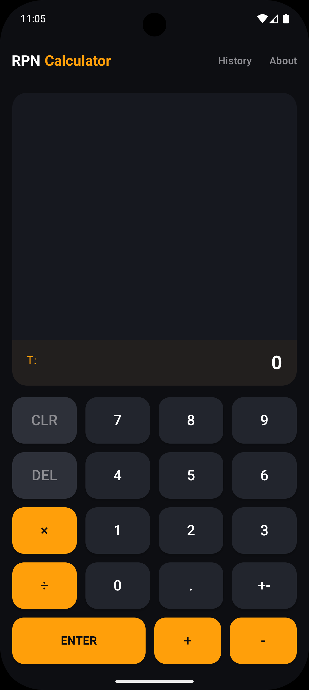
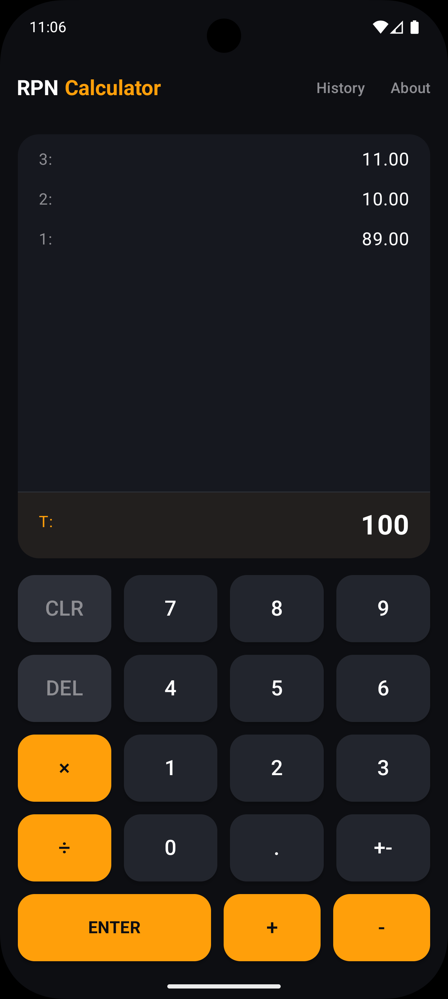
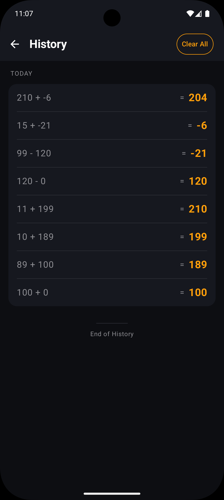
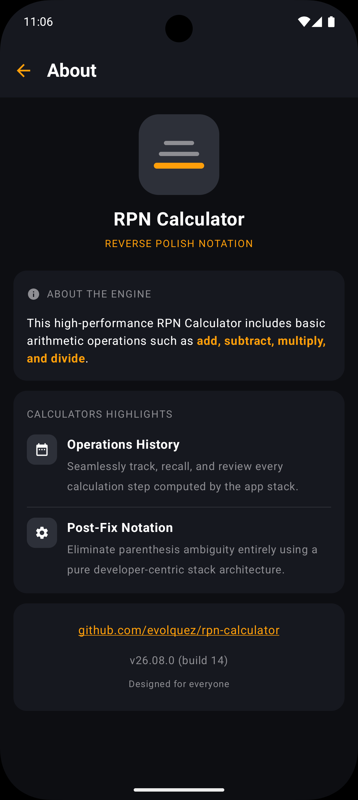

# RPN Calculator — Android 🧮

A native Android calculator built around **Reverse Polish Notation (RPN)** — the postfix, stack-based
notation used by classic HP calculators. Instead of `5 + 3 =`, you enter `5 ENTER 3 +`: operands are
pushed onto a stack and operators consume the top of it, so there's never any operator precedence or
parentheses to worry about.

The app supports the four basic operations (add, subtract, multiply, divide), keeps a persistent,
date-grouped history of every calculation, and shows the live stack — not just the current value — so
you can always see what you're about to operate on.

## Screenshots

<table>
<tr>
<td></td>
<td></td>
<td></td>
<td></td>
</tr>
</table>

## Features

- **Postfix (RPN) entry** — add, subtract, multiply, divide, with a visible stack instead of a single
  running total
- **Persistent history** — every calculation is saved locally and grouped by date (*Today*,
  *Yesterday*, or the exact date), with a one-tap clear
- **Dark, single theme** — a fixed dark/orange palette used consistently across all three screens
- **Dev/prod build flavors** — a distinctly-labeled debug build installable alongside the release app

## Tech Stack

| Layer | Choice |
|---|---|
| Language | [Kotlin](https://kotlinlang.org/) |
| UI | [Jetpack Compose](https://developer.android.com/jetpack/compose) + [Material 3](https://m3.material.io/) |
| Navigation | [Navigation Compose](https://developer.android.com/jetpack/compose/navigation) |
| Architecture | MVVM — `StateFlow`-backed `ViewModel`s, unidirectional data flow |
| DI | [Hilt](https://dagger.dev/hilt/) |
| Persistence | [Room](https://developer.android.com/training/data-storage/room) |
| Async | Kotlin [Coroutines](https://kotlinlang.org/docs/coroutines-overview.html) & [Flow](https://kotlinlang.org/docs/flow.html) |
| Annotation processing | [KSP](https://kotlinlang.org/docs/ksp-overview.html) |
| Build | Gradle (Groovy DSL), version catalogs not yet adopted |

## Architecture

Pragmatic MVVM, feature-organized, with only as much layering as the app actually needs — no
repository interfaces without a second implementation, no use-case classes wrapping a single
repository call.

```
app/src/main/java/com/oletob/rpncalc/
├── RpnApplication.kt          # @HiltAndroidApp
├── MainActivity.kt            # single Activity — hosts the Compose NavHost
├── data/
│   ├── local/                 # Room: AppDatabase, MathOperationDao, MathOperation entity
│   └── repository/            # MathOperationRepository — Dao access, Flow-based reads
├── di/
│   └── DatabaseModule.kt      # the one Hilt module the app needs (Room can't be constructor-injected)
├── ui/
│   ├── navigation/            # AppNavGraph, Destinations
│   └── theme/                 # Color / Theme tokens (Compose)
└── feature/
    ├── calculator/            # CalculatorScreen + CalculatorViewModel (the RPN engine)
    ├── history/                # HistoryScreen + HistoryViewModel
    └── about/                 # AboutScreen (stateless — no ViewModel needed)
```

Each `ViewModel` talks straight to `MathOperationRepository`; there's no domain/use-case layer because
none of the current features have business logic that spans multiple repositories or needs its own
abstraction — the RPN stack math itself lives directly in `CalculatorViewModel`.

## Requirements

- Android Studio (current stable)
- JDK 17
- Android SDK: `compileSdk` / `targetSdk` 37, `minSdk` 24

## Getting Started

```bash
git clone https://github.com/evolquez/rpn-calculator.git
cd rpn-calculator
./gradlew assembleDevDebug
```

The project has two product flavors:

- **`dev`** — applied `.dev` application-id suffix, labeled "RPN Dev", safe to install side-by-side
  with the store version
- **`prod`** — the Play Store build, labeled "RPN Calculator"

Open the project in Android Studio and run the `dev` + `debug` build variant to get started, or build
from the command line with `./gradlew assembleDevDebug` / `./gradlew assembleProdRelease`.

## Versioning

This project uses **[Calendar Versioning](https://calver.org/)**: `YY.0M.MICRO`.

- `YY` — two-digit year
- `0M` — zero-padded month
- `MICRO` — release number within that month, starting at `0`

For example, `26.08.0` is the first release shipped in August 2026. `versionCode` still increments by
1 with every release, as required by Google Play.

## Download

[RPN Calculator on Google Play][play-store]

## Author

**Algenis Volquez** — [github.com/evolquez](https://github.com/evolquez)

[play-store]: https://play.google.com/store/apps/details?id=com.oletob.rpncalc
